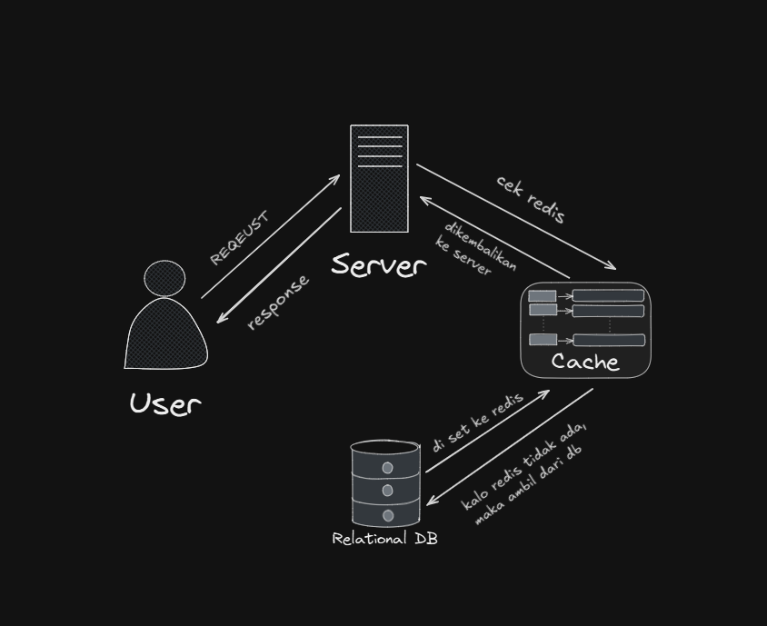
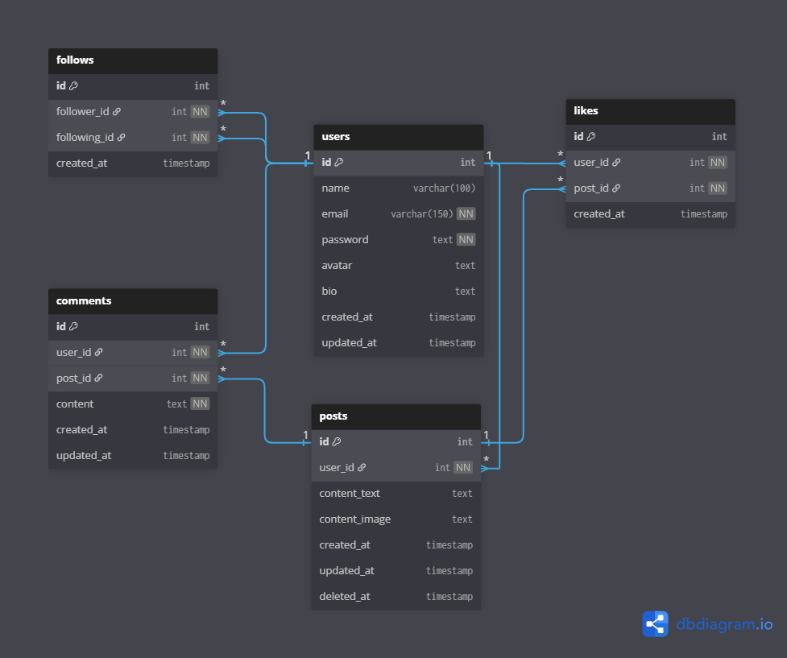

# Social Media


This project is a backend submission task developed as part of the Koda Tech Academy Bootcamp. It implements a simple Social Media API using Golang, designed to demonstrate backend development skills and best practices.

## System Design



## ERD



## 🔧 Tech Stack

- [Go](https://go.dev/dl/)
- [PostgreSQL](https://www.postgresql.org/download/)
- [Redis](https://redis.io/docs/latest/operate/oss_and_stack/install/archive/install-redis/install-redis-on-windows/)
- [JWT](https://github.com/golang-jwt/jwt)
- [migrate](https://github.com/golang-migrate/migrate)
- [Docker](https://docs.docker.com/engine/install/ubuntu/#install-using-the-repository)
- [Swagger for API docs](https://swagger.io/) + [Swaggo](https://github.com/swaggo/swag)

## 🗝️ Environment

```bash
# database
DBUSER=<your_database_user>
DBPASS=<your_database_password>
DBNAME=<your_database_name
DBHOST=<your_database_host>
DBPORT=<your_database_port>

# JWT
JWT_SECRET=<your_secret_jwt>
JWT_ISSUER=<your_jwt_issuer>

# Redis
RDB_HOST=<your_redis_host>
RDB_PORT=<your_redis_port>
```

## ⚙️ Installation

1. Clone the project

```sh
$ https://github.com/Darari17/social-media.git
```

2. Navigate to project directory

```sh
$ cd social-media
```

3. Install dependencies

```sh
$ go mod tidy
```

4. Setup your [environment](##-environment)

5. Install [migrate](https://github.com/golang-migrate/migrate/tree/master/cmd/migrate#installation) for DB migration

6. Do the DB Migration

```sh
$ migrate -database YOUR_DATABASE_URL -path ./db/migrations up
```

or if u install Makefile run command

```sh
$ make migrate-createUp
```

7. Run the project

```sh
$ go run ./cmd/main.go
```

## 🚧 API Documentation

| Method | Endpoint             | Body                                            | Description            |
| ------ | -------------------- | ----------------------------------------------- | ---------------------- |
| GET    | /img                 |                                                 | Static File            |
| POST   | /auth/login          | email:string, password:string                   | Login                  |
| POST   | /auth/register       | email:string, password:string                   | Register               |
| GET    | /auth/logout         | header: Authorization (token jwt)               | Logout                 |
| GET    | /users               | header: Authorization (token jwt),              | Get All Users          |
| GET    | /users/profile       | header: Authorization (token jwt),              | Get Profile            |
| PATCH  | /users/profile       | header: Authorization (token jwt), body         | Update Profile         |
| GET    | /users/:id/followers | params                                          | Get Followers          |
| GET    | /users/:id/following | params                                          | Get Following          |
| POST   | /posts               | header: Authorization (token jwt), body         | Post Content           |
| GET    | /posts               |                                                 | Get All Posts          |
| GET    | /posts/:postId       |                                                 | Get Post by Post ID    |
| PATCH  | /posts/:postId       | header: Authorization (token jwt), params, body | Update Post            |
| DELETE | /posts/:postId       | header: Authorization (token jwt),              | Delete Post            |
| POST   | /posts/:id/like      | header: Authorization (token jwt)               | Like Post              |
| POST   | /posts/:id/unlike    | header: Authorization (token jwt)               | Unlike Post            |
| GET    | /posts/:id/likes     | header: Authorization (token jwt)               | Likes Post             |
| POST   | /posts/:id/comments  | header: Authorization (token jwt), params, body | Post Comment           |
| GET    | /posts/:id/comments  | header: Authorization (token jwt), params       | Get Comment by Post ID |
| PUT    | /posts/comments/:id  | header: Authorization (token jwt), params,body  | Update Post            |
| DELETE | /posts/comments/:id  | header: Authorization (token jwt), params       | Delete Post            |
| POST   | /follow/:id          | header: Authorization (token jwt), params       | Follow User            |
| DELETE | /follow/:id          | header: Authorization (token jwt), params       | Unfollow User          |

## 📄 LICENSE

MIT License

Copyright (c) 2025 Farid Rhamadhan Darari

## 📧 Contact Info

[faridramadhan59@gmail.com](mailto:faridramadhan59@gmail.com)
